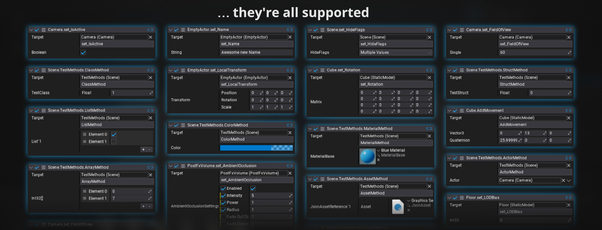

#### Table of Contents
1. [What is FlaxEvent?](#what-is-flaxevent)
2. [How to use in Editor](#how-to-use-in-editor)
3. [How to use in Code](#how-to-use-in-code)
4. [Benchmark](#benchmark)
5. [Setup](#how-to-set-up)
6. [Installation](#how-to-install)

## What is FlaxEvent?

> _for artists, designers, and anyone who prefers visual setup_

`FlaxEvent` is a visual event and messaging system for the Flax Engine. It lets artists, designers and programmers create modular and decoupled logic between actors, scripts and assets through the user interface.


## How to use in Editor

|**Easy Visual Setup**||
|-----|------|
|**Drag & Drop Target Selection** <br/> Pick Actors and methods directly in the Editor||
|**Find methods instantly** <br/> Quickly search thru all available methods||
|**Automatic Parameter Matching** <br/> Setup any parameters a method requires||

|**List Management**||
|-----|------|
|**Drag & Drop Reorder** <br/> Move calls up or down in the list||
|**Drag & Drop Swap** <br/> Swap the position of two calls instantly||

|**Per-Call Toggles**||
|-----|------|
|**Enable / Disable** <br/> Turn a call on or off without deleting it||
|**Link / Unlink Runtime Parameters** <br/> Control whether a call automatically receives the parameters passed into `Invoke()`||

|**Copy & Duplication**||
|-----|------|
|Copy/Paste/Duplicate||


## How to use in Code

#### Example
```cs
public class MyScript : Script
{
    
    public FlaxEvent MyEvent = new();                     // Event without parameters
    public FlaxEvent<string, int> ParameterEvent = new(); // Event with parameters

    public override void OnUpdate()
    {
        // Invoking the event from code
        MyEvent?.Invoke();

        // Editor-Configured listeners can receive the parameters you pass here.
        // The ONLY requirement: The listener method must match the events signature 
        // > i.e. (string, int)
        ParameterEvent?.Invoke("some cool text", 7);
    }
}
```


#### Supported event signatures

```cs
public FlaxEvent MySimpleEvent = new();
public FlaxEvent<T> MySmallEvent = new();
public FlaxEvent<T0, T1> MyMediumEvent = new();
public FlaxEvent<T0, T1, T2> MyLargeEvent = new();
public FlaxEvent<T0, T1, T2, T3> MyHugeEvent = new();
```


#### Runtime listeners

```cs
public FlaxEvent<string, int> MyEvent = new();

public override OnEnable()
{
    MyEvent?.AddListener(HelloWorldMethod);
    ...
}

public override OnDisable()
{
    MyEvent?.RemoveListener(HelloWorldMethod);
    ...
}

// Runtime listeners need to match the events signature 
// > i.e. (string, int)
public void HelloWorldMethod(string message, int intValue)
{
    Debug.Log(message + intValue.ToString());
}
```


## Benchmark

These numbers show how FlaxEvents compare to standard C# delegates. Results may vary dependend on hardware (tested on my old FX-8350 CPU).


|Event Type        |(Editor) First Uncached|(Editor) Cached|(Game) First Uncached|(Game) Cached|
|-------------------------|-------------------------------|-------------------------------|-----------------------------|-----------------------------|
|FlaxEvent Editor Call    | ~0.02ms                       | ~0.0008ms                     | ~0.02ms                     | ~0.0005ms                   |
|FlaxEvent Runtime Call   | ~0.003ms                      | ~0.0007 ms                    | ~0.0008ms                   | < 0.00001ms                 |
|C# Action Delegate       | ~0.001ms                      | ~0.0005 ms                    | ~0.0003ms                   | < 0.00001ms                 |

\
Test setup: 
- 500 Cube Actors in one scene
- 3 cases measured: editor-configured-only event, runtime-only event, pure C# Action
- Each invoked `Actor.OnActiveChanged` on every cube actor
- First Invoke: no cached calls; does 500 method invokes total
- Subsequent Invokes: cached calls, repeated 1.000x (500.000 method invokes total)


## How to Set Up
- [Install](#how-to-install) the plugin
- Add the dependency to the `*.Build.cs` file in any module that uses FlaxEvents
```cs
/// <inheritdoc />
public override void Setup(BuildOptions options)
{
    ...

    options.PublicDependencies.Add(nameof(FlaxEvent));
    // or
    options.PublicDependencies.Add("FlaxEvent");
    ...
}
```


## How to Install
#### The easy way: 
- In the Flax Editor, go to `Tools > Plugins > Clone Project`
- Paste this repo link `https://github.com/Myterian/FlaxEvent.git` into the `Git Path`
- Click `Clone`
- Restart the Editor
- Done

#### Manual installation:
- Close the Editor
- Clone this repo into `<your-game-project-folder>\Plugins\FlaxEvent\`
- Add a reference to FlaxEvent to your game, by modifying the `<your-game>.flaxproj` file
```
...
"References": [
    {
        "Name": "$(EnginePath)/Flax.flaxproj"
    },
    {
        "Name": "$(ProjectPath)/Plugins/FlaxEvent/FlaxEvent.flaxproj"
    }
]
...
```
- Restart the Editor
- Done


## Known Issues
Tested on FlaxEngine v. 1.11
- FlaxEditors `Undo` will throw an error, when trying to undo changes to a FlaxEvent FlaxEngine/FlaxEngine#3832


